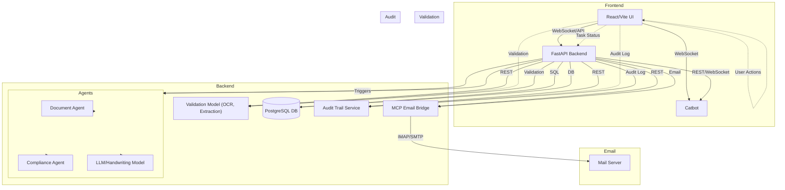

# ad1
 ad1 is a secure, modular platform for automated email and document processing, designed to meet strict Swiss and EU compliance requirements. 
# ad1 – Automated Email & Document Processing

## Overview

ad1 is a secure, modular platform for automated email and document processing, designed to meet strict Swiss and EU compliance requirements. The system leverages intelligent agents, a persistent PostgreSQL database, audit trails, and a WebSocket-based chat for workflow orchestration. All components are hosted in Switzerland or on Swiss-compliant infrastructure, supporting both on-prem and cloud GPU options.

### Tasks

> You can select tasks by date and validate them, or restart workflows

### Human Validation


## Client Requirements (from briefing multiagent.md)

- **Swiss Hosting & Compliance**: All components (including LLMs) are hosted in Switzerland or with providers guaranteeing data residency in CH. GDPR, Swiss DSGVO, and AI law compliance are enforced. Role-based access, audit trails, and data retention policies are implemented.
- **Open-Source LLMs**: Only open-source LLMs are used, either self-hosted or via Swiss providers (e.g., SwissGPT, Infomaniak, Kvant). Optionally, a fully self-hosted LLM stack (e.g., LLaMA, Mistral) can be deployed.
- **Orchestration**: Workflows are orchestrated by a daemon and can be triggered via chat (Catbot) or automatically on new email arrival. n8n is referenced for orchestration, but the system is modular and can integrate with other orchestrators if needed.
- **Agent Layer**: Agents handle context tracking, compliance checking, document/report generation, and validation. After each processing step, human-in-the-loop validation is enforced.
- **Input/Output**: Supports ingestion of emails, PDFs, Word, and Excel files. Output includes processed documents, validation status, and audit logs. Finalized documents are encrypted and sent via email.
- **Scalability**: The architecture is modular and decoupled, allowing for easy extension with new templates, data sources, or AI models.

## Technical Architecture

- **Daemon for Email API**: Monitors the inbox (via MCP server), ingests new emails, and updates the task section in the database. Each relevant email or document becomes a processing task.
- **Task & Document Workflow**: All documents to be processed are tracked as tasks in the database. Each task has a status (pending, processing, needs validation, validated, failed) and links to the original and processed files.
- **Human-in-the-Loop Validation**: After agent processing, tasks require manual validation. The validation UI displays the original document (left) and the processed result (right, including extracted values and handwriting recognition). Below are buttons to abort, restart (with prompt), or validate the task.
- **Audit Trail**: Every action (processing, validation, abort, etc.) is logged for compliance and traceability. Audit logs are visible in the UI.
- **Encryption & Secure Email Sending**: Once validated, documents are encrypted and sent via email. All transmission and storage is secured.
- **Extensible Model Integration**: For handwriting and advanced document recognition, a dedicated model is used (self-hosted or via a Swiss provider). The system is modular for future model or provider swaps.

## Workflow

1. **Email Ingestion**: Daemon fetches and classifies new emails, creating tasks for relevant documents.
2. **Document Processing**: Documents are processed by agents (including handwriting/field extraction).
3. **Validation**: Human validates the processed result in the Validation UI (original left, processed right, action buttons below).
4. **Audit Logging**: All actions are logged and visible in the Audit Trail UI.
5. **Encryption & Sending**: On validation, the document is encrypted and sent via email.
6. **Status Tracking**: Task status is updated throughout; users can see and manage all tasks.

## API Overview

- `/api/emails` – List, detail, and label emails
- `/api/documents` – Upload, list, and process documents
- `/api/validation` – Manage validation tasks (approve, abort, restart)
- `/api/audit` – View audit logs
- `/ws/agent` – WebSocket chat for agent interaction

## Frontend Structure

- **Inbox**: List and filter all emails, see processing status, trigger workflows, and label emails.
- **Documents**: Upload, view, and manage documents. See processing status and link to validation.
- **Validation**: Human-in-the-loop validation interface. Left: original document; Right: processed result (fields, handwriting, etc.). Below: Approve, abort, or restart with prompt. Audit trail for each task is visible. On validation, document is encrypted and sent.
- **Audit Trail**: View all actions and changes for compliance.
- **Agent Chat**: WebSocket chat to trigger workflows, ask for status, or interact with Catbot.
- **Task Section**: Overview of all processing tasks, their status, and actions (select, validate, abort, etc.).

## Security & Compliance

- All data and servers are hosted in Switzerland (Google Cloud CH, on-prem, or Swiss providers)
- Encryption for data at rest and in transit
- GDPR, Swiss DSGVO, and AI law compliance
- Role-based access and audit trails

## Quick Start

1. **Requirements**: Docker, Docker Compose
2. **Start the system**:
   ```bash
   docker compose up --build
   ```
3. **Frontend**: Start with `npm run dev` in the `frontend/` directory (if developing locally)
4. **Database**: Initialized automatically

## File Structure

- `backend/` – FastAPI backend (agents, email, document, validation, audit)
- `frontend/` – React/Vite frontend (Inbox, Documents, Validation, Audit, Chat, Tasks)
- `db/` – Database initialization scripts
- `mcp/` – MCP server for email integration

## System Architecture (Mermaid Diagram)



---

For more details, see the API documentation and the `briefing multiagent.md` file.

