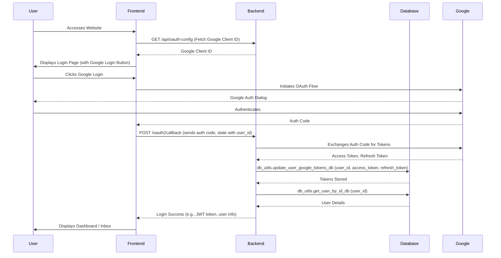
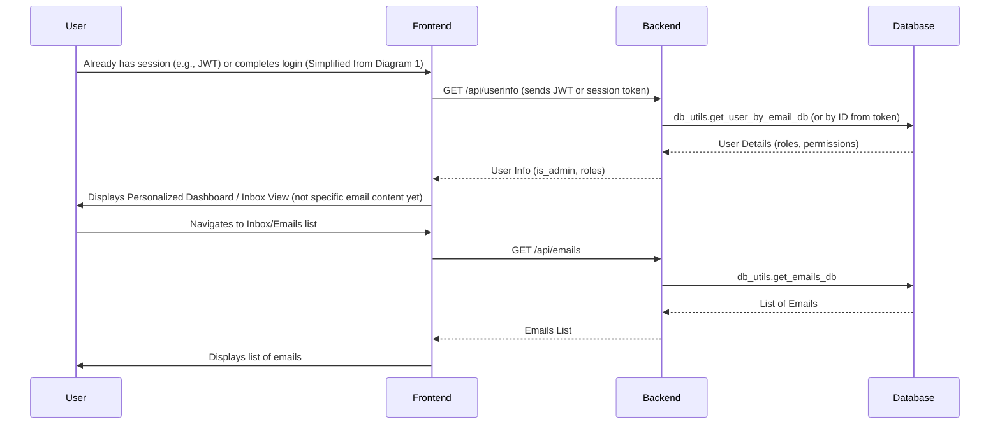
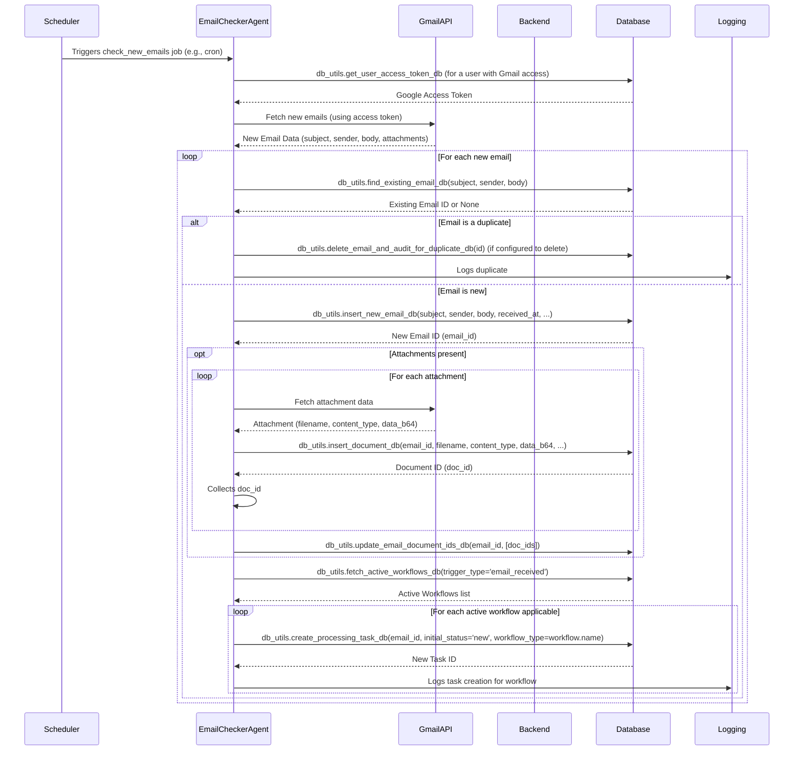

# Website Login and Email Checker Flow Diagrams

This document outlines the different flows involved in user authentication and email processing within the system.

## 1. Website Login Flow

This diagram illustrates the sequence of events when a user accesses the website and logs in.

**Key Backend Endpoints & DB Utils:**

*   **Backend API:**
    *   `GET /api/oauth-config`: Provides OAuth client details to the frontend.
    *   `POST /oauth2callback`: Handles the OAuth callback from Google, exchanges code for tokens.
    *   (Implicit) `/api/userinfo` or similar might be called by frontend post-login to fetch user details if not returned by `/oauth2callback`.
*   **`db_utils.py` functions:**
    *   `update_user_google_tokens_db`: Stores or updates the user's Google OAuth tokens.
    *   `get_user_by_id_db` (or `get_user_by_email_db`): Retrieves user information after successful authentication.

## 2. Login Flow - Main Email Not Shown

This diagram illustrates a general login verification and dashboard loading scenario, without focusing on displaying a specific email's content immediately.

**Key Backend Endpoints & DB Utils:**

*   **Backend API:**
    *   `GET /api/userinfo`: Verifies user session and fetches basic user data.
    *   `GET /api/emails`: Fetches the list of emails for the user.
*   **`db_utils.py` functions:**
    *   `get_user_by_email_db` (or `get_user_by_id_db`): Retrieves user information for authentication/authorization.
    *   `get_emails_db`: Retrieves all emails for the user's inbox view.

## 3. Email Checker Workflow

This diagram details how the `email_checker` agent processes new emails.

**Key `db_utils.py` functions:**

*   `get_user_access_token_db`: To get credentials for accessing Gmail.
*   `find_existing_email_db`: Checks if an email has already been processed.
*   `delete_email_and_audit_for_duplicate_db`: Handles duplicate emails.
*   `insert_new_email_db`: Saves new email metadata to the database.
*   `insert_document_db`: Saves email attachments to the database.
*   `update_email_document_ids_db`: Links saved documents to their parent email.
*   `fetch_active_workflows_db`: Retrieves workflow configurations that should be triggered by new emails.
*   `create_processing_task_db`: Creates a new task in the `tasks` table for each relevant workflow to process the email.

**Key Backend Components:**

*   `agent.email_checker.check_new_emails`: The core function orchestrating this flow.
*   `AgentScheduler`: Triggers the `check_new_emails` job.
